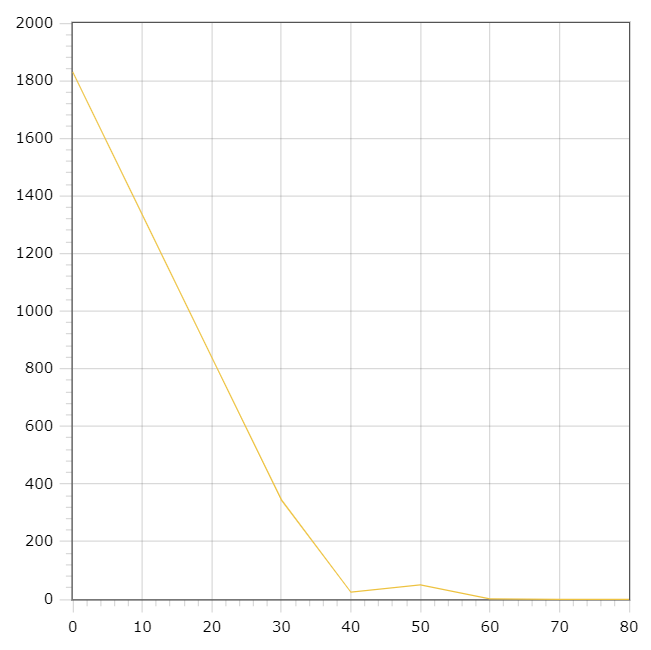

# TaskManager

### Queue implementation

A data structure such as a queue has been created for this laboratory work. Its job is to organise and manipulate FIFO data (first input - first output). Methods such as adding an element to the queue ( push ), removing an element ( pop ) and checking for emptiness have been implemented. The queue was implemented on the basis of a linked list and the input data is a value type. 
The linked list was implemented using the Node data structure, which has only one ptr field - a pointer to the current queue object. 

### Task Manager 

The Task Manager consists of one parameter of the queue type and three methods: adding a task, performing the task and outputting the result data. 

### Structure Value

The structure of the value stores the time it takes to complete the task. 

### Multithreading 

Two streams were used to implement multithreadreading. The first one performs the addition of the task to the queue. Each task is given randomly the time to complete it. After successful execution, the task is entered by the second thread, which removes the task from the queue and informs about its completion. A separate output function was implemented using a mutex so that the output threads do not intersect. 

### Examples of how the program works: 

 ​

